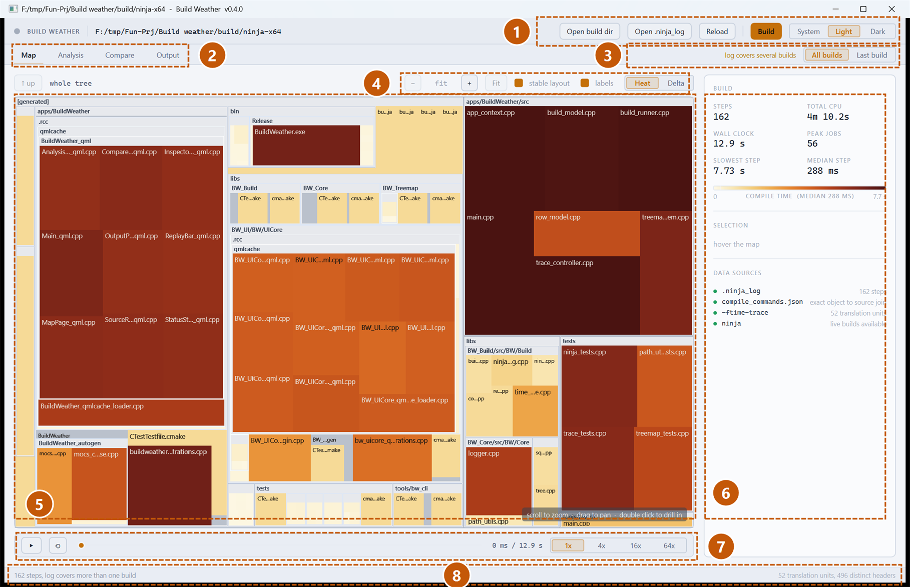
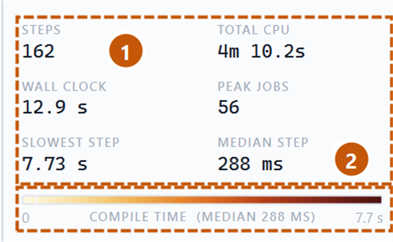
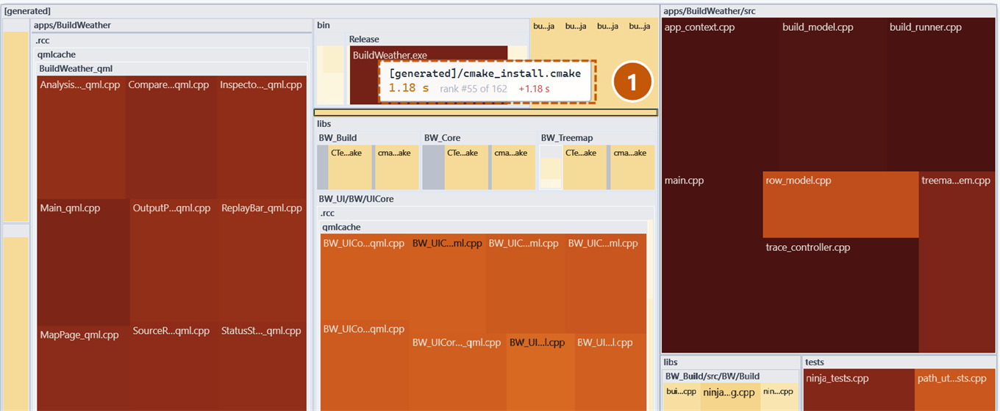
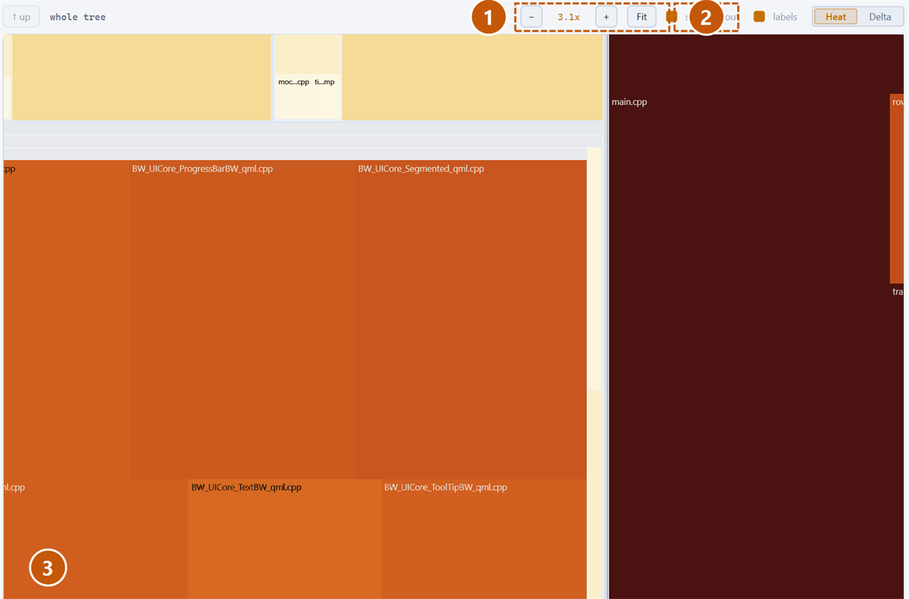
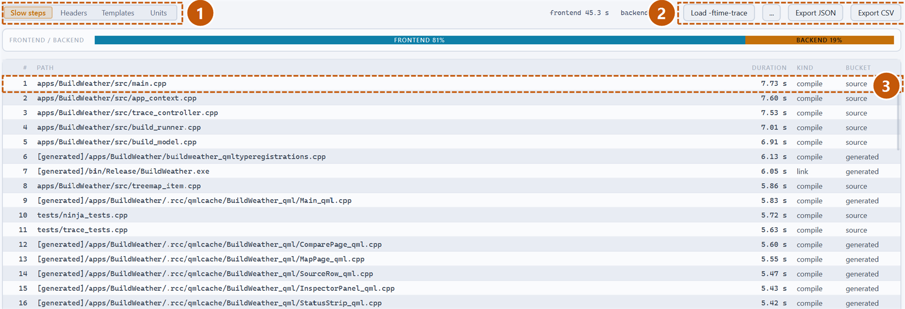
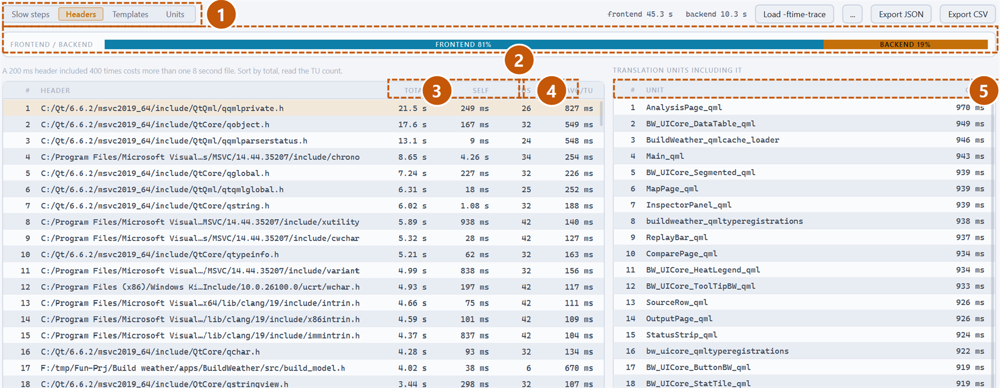
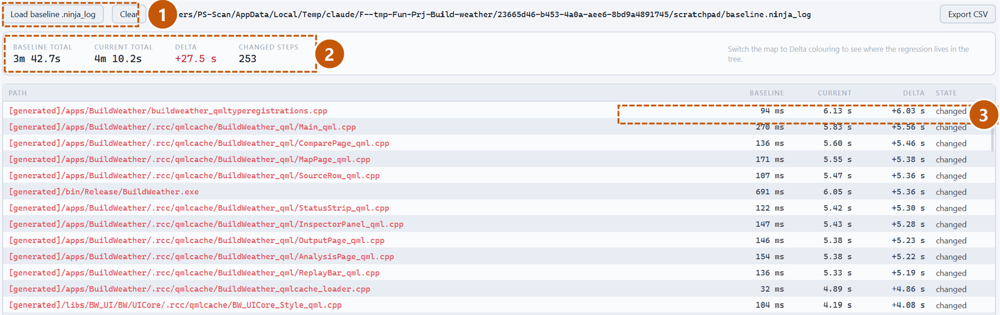
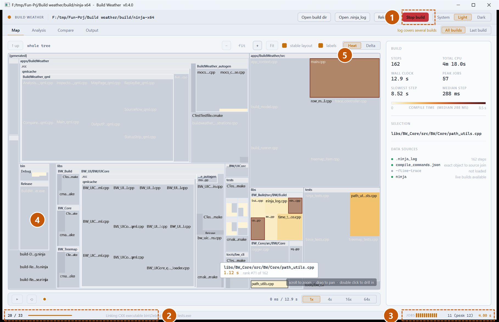
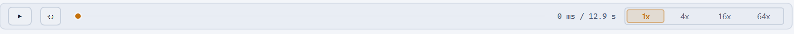
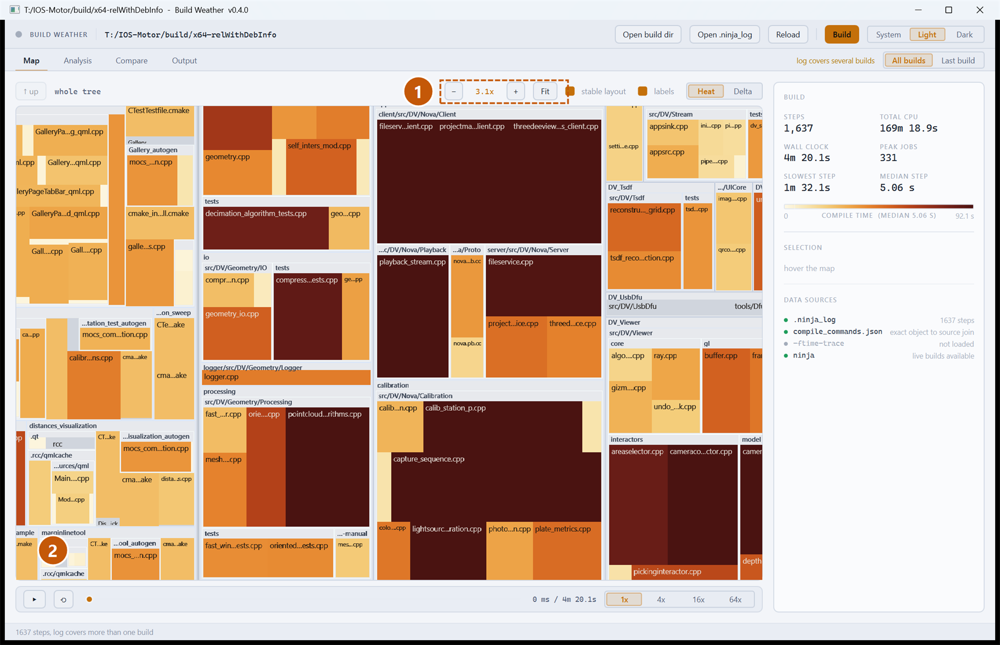

# Build Weather — User Guide

Version 0.4

Build Weather turns a C++ build into a picture of your source tree. Instead of
reading a scrolling wall of compiler output, you look at a treemap: every file
is a rectangle, its area is what it costs to build, and its colour is how long
it took. Watching a build run looks like weather crossing a map. Watching one
afterwards tells you which header is quietly adding minutes to every rebuild.

This guide walks through each part of the window, then through the four things
you will actually do with it.

---

## 1. Before you start

Build Weather reads three files that your build system already produces. You
do not have to instrument anything.

| File | Where it comes from | What it gives you |
| --- | --- | --- |
| `.ninja_log` | Written by ninja automatically | Exact start and end time of every build step |
| `compile_commands.json` | CMake's `EXPORT_COMPILE_COMMANDS` option | Which source file each object came from |
| `*.json` next to each object | clang-cl with `-ftime-trace` | Per-header and per-template cost inside each file |

Only the first is required. The second makes the map show your source files
instead of paths under `CMakeFiles/`. The third unlocks the header and
template rankings on the Analysis tab.

So: **configure your project with CMake and the Ninja generator**, build it
once, and point Build Weather at the build directory.

```
cmake -S . -B build/ninja -G Ninja -DCMAKE_EXPORT_COMPILE_COMMANDS=ON
cmake --build build/ninja
```

> **Live builds need a developer environment.** `cl.exe` cannot find the
> standard headers unless `INCLUDE` and `LIB` are set, and an application
> started from Explorer does not have them. Start Build Weather from a
> Developer Command Prompt if you want to run builds from inside it. The app
> checks this and warns you on the Output tab rather than letting the map fill
> up with identical errors.

---

## 2. The window

Open a build directory with **Open build dir**, or pass it on the command line:

```
BuildWeather.exe build\ninja --source . --traces build\clangcl
```



1. **File actions.** Open a build directory or a `.ninja_log` directly,
   re-read it after another build, and start a build from inside the app.
   The theme switch on the right follows your system by default.
2. **Tabs.** Map, Analysis, Compare and Output. The Map is the picture; the
   Analysis tab is where the numbers live.
3. **Scope.** A `.ninja_log` accumulates across every build you have ever run
   in that directory. *All builds* takes each target's most recent entry,
   which answers "what does a full build of this tree cost". *Last build*
   keeps only the most recent ninja run. The note beside it appears when the
   log covers more than one build, because that changes what the timeline
   means.
4. **Map controls.** Zoom out, current zoom, zoom in, Fit. Then *stable
   layout* and *labels*, and the colour mode: **Heat** for compile time,
   **Delta** for the difference against a baseline build.
5. **The map.** Directories nest, each file is a leaf. Area is compile time,
   colour is compile time on the scale shown in the panel to the right.
6. **Build summary and legend.** Totals, the colour scale with the median
   marked on it, whatever you last hovered or clicked, and which data sources
   were found.
7. **Replay transport.** Scrub through the build and watch it happen again.
8. **Status.** What is loaded, and during a build the progress, elapsed time
   and how many compiler jobs are actually running.

---

## 3. Reading the map

Every rectangle is one build step. **Area is compile time** and **colour is
compile time**, on the scale shown in the summary panel.

{.narrow}

1. **Totals.** Steps in the snapshot, the CPU time they add up to, the wall
   clock the build actually took, the slowest single step and the median one.
   The gap between median and slowest is the shape of your problem: a high
   median means the whole build is slow, while a median of 200 ms next to a
   slowest step of 90 s means a handful of files are the whole story.
2. **The colour scale**, with the median marked on it as a tick.

The scale flips with the theme so that "expensive" is always the colour
furthest from the page: pale cream to deep red on the light theme, near-black
to bright yellow on the dark one. Encoding time twice, as area and as colour,
is deliberate: size finds the expensive files from across the room, and colour
still works for the small cells where area has run out of pixels.

### The three buckets

Not everything a build compiles is your code, and thousands of toolchain
headers would swamp the picture if they were mixed in. Anything that is not a
file under your source root is put in one of three synthetic directories:

| Bucket | What lands there |
| --- | --- |
| `[generated]` | Anything under the build directory: moc output, qmlcache, protobuf, the linked binaries |
| `[external]` | Absolute paths outside both roots, such as a vendored SDK |
| `[system]` | Toolchain and SDK headers |

---

## 4. Finding your way around the map

Hover any cell for its full path, its duration, and its rank.



1. The tooltip follows the cell rather than the cursor, so it does not jitter
   while you scan across small files. Hovering a *directory* header gives you
   the total for everything inside it, which is the number you want when
   looking for a hot module.

On a real project the whole tree does not fit legibly on one screen. Scroll to
zoom and drag to pan.



1. Zoom out, the current factor, zoom in.
2. **Fit** goes back to the whole tree. `Ctrl+0` does the same.
3. Zooming recomputes the layout rather than magnifying the picture, so cell
   labels stay sharp and more of them appear as there becomes room. This is
   how you read file names on a large project.

| Action | Gesture |
| --- | --- |
| Zoom about the cursor | Mouse wheel |
| Pan | Drag with the left button |
| Select a cell | Click |
| Drill into a directory | Double click |
| Back up one level | Right click, or **↑ up** |
| Fit the whole tree | **Fit**, or `Ctrl+0` |

**Stable layout** is on by default. It orders cells by name rather than by
duration, so a file keeps its position from one build to the next and only its
area changes. That is what makes two builds comparable by eye. Turning it off
packs the rectangles into squarer shapes, at the cost of everything moving
whenever a timing moves.

---

## 5. Finding the expensive step

The Analysis tab is deliberately plain: no animation, just numbers.



1. Four views: **Slow steps** from `.ninja_log`, then **Headers**,
   **Templates** and **Units**, which need `-ftime-trace` data.
2. **Export JSON** or **Export CSV** writes the current ranking to a file so
   you can paste numbers into a discussion or diff them in a script.
3. Each row is one step: rank, path, duration, what kind of step it was, and
   which of the three buckets it belongs to.

---

## 6. Finding the expensive header

This is the view that pays for the tool, and it needs a clang-cl build with
`-ftime-trace`. MSVC has no equivalent, so this is a second build directory
used only to produce the data:

```
tools\make-time-traces.cmd
```

Then press **Load -ftime-trace** and point it at that directory.



1. The **Headers** view.
2. The frontend / backend split for the whole project. A build that is mostly
   frontend is dominated by parsing and template instantiation, which is what
   include hygiene fixes. A build that is mostly backend is dominated by
   optimisation, which it does not.
3. **Total** is the cost of this header summed across every file that includes
   it. **Self** excludes what it pulls in, so a large total with a small self
   means the header is expensive because of *its* includes, not its own text.
4. **TUs** is how many translation units include it. This is the column that
   matters: a 200 ms header included 400 times costs more than one eight
   second file, and only this ranking shows that.
5. Click any header to list the translation units that include it, so you know
   where to start cutting.

---

## 7. Comparing two builds

Copy a `.ninja_log` aside before the change you want to measure, then load it
as a baseline.



1. **Load baseline .ninja_log**, or pass `--baseline <file>` on the command
   line. **Clear** drops it again.
2. Baseline total, current total, the difference, and how many steps changed.
3. One row per step, sorted worst regression first. Red is slower, green is
   faster, and steps that only exist on one side are marked `added` or
   `removed`.

Switch the map to **Delta** colouring to see *where* in the tree the
regression lives rather than just which files moved.

---

## 8. Watching a build

Press **Build** (or `Ctrl+B`) to run ninja in the loaded build directory.



1. **Stop build** cancels it. The pip beside the wordmark beats while a build
   is running.
2. Progress through the plan and elapsed time.
3. **Jobs**: how many compiler processes are actually running right now, taken
   from ninja itself. Watching this collapse near the end of a build, because
   everything is waiting on one enormous translation unit, is genuinely
   diagnostic.
4. Cool grey cells have not been rebuilt. This build only recompiled part of
   the tree, and the grey is everything ninja decided was already up to date.
5. Cells flash as they complete and settle to their final colour over about
   400 ms. With a dozen jobs in flight this reads as a shimmer crossing the
   map.

> Ninja only reports a step as it *finishes* when its output is a pipe, which
> is what a child process gets. So the map animates on completion rather than
> on start, and the job count comes from ninja's own counter rather than being
> inferred. The timings are exact either way.

The **Output** tab has the raw ninja output, with errors and warnings
highlighted. When a build fails, that is where the reason is.

---

## 9. Replaying a build

You do not have to be there when a build runs. Every `.ninja_log` already
contains a start and an end for each step, so any build already in the log can
be replayed without having captured anything extra.



From left to right: **play / pause**, **rewind to the start**, the
**scrubber**, the position and total, and the **playback rate**. An **Exit
replay** button appears beside them once a replay is running, and `Esc` does
the same.

Drag the scrubber to jump to any moment; the map shows exactly which files were
in flight then, and the jobs readout in the status bar shows how many. That is
the quickest way to answer "what was the build waiting on at the 40 second
mark".

Two things to know:

- **Speed only has an effect while playing.** A four minute build at 1x takes
  four minutes to watch, so pick 16x or 64x. Choosing a rate starts playback
  for exactly this reason.
- **Switch the scope to Last build first.** Timestamps from different ninja
  runs come from different clocks, so replaying a log that covers several
  builds mixes them. The transport warns you when that is the case, and *Last
  build* narrows the data to a single run where the timeline is exact.

---

## 10. Large projects



1. Zoom is what makes a project of this size readable.
2. At fit zoom you can see the shape of the build and which modules are hot.
   Zoom in to read names, drill into a directory to give it the whole window.

Layout is recomputed on every zoom step and stays inside a frame at several
thousand files. Cells scrolled out of view are not drawn at all.

---

## 11. Working from the command line

`bw_cli` runs the same analysis without a window, for CI or a quick answer.

```
bw_cli.exe analyze build\ninja --traces build\clangcl --top 20
```

```
bw_cli.exe compare old.ninja_log build\ninja\.ninja_log --csv deltas.csv
```

`analyze` prints the build summary, the slowest steps and the header ranking.
`--json` and `--csv` write the same data to a file.

---

## 12. What the numbers mean

Worth being precise about, because a treemap invites more trust than it earns.

**Durations are exact.** They come from `.ninja_log`, which records the start
and end of every step in milliseconds. Nothing is sampled or estimated.

**A log accumulates across builds.** See the scope switch in section 2. When the header
says "log covers several builds", the durations are still each exact but they
were measured at different times, and the *timeline* mixes clocks.

**Several steps can share one file.** A generated source is written by one
step and compiled by another. Both belong at that leaf, so their durations are
summed: that is what the file costs you.

**Zero-duration steps are still drawn.** They get a minimum area, so a fast
file does not silently vanish from the tree.

**`-ftime-trace` numbers describe a clang build.** If your real build is MSVC,
the absolute times will differ. The *ranking* of headers is what transfers.

---

## 13. Keyboard reference

| Key | Action |
| --- | --- |
| `Ctrl+O` | Open a build directory |
| `Ctrl+B` | Start or stop a build |
| `F5` | Re-read the log |
| `Ctrl+0` | Fit the map |
| `Ctrl++` / `Ctrl+-` | Zoom in / out |
| `Esc` | Leave replay |
